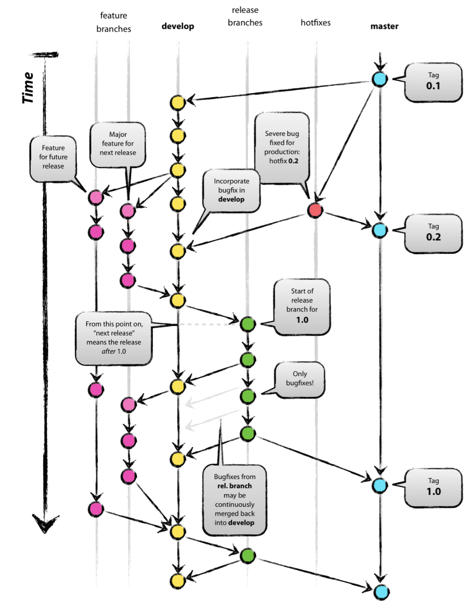
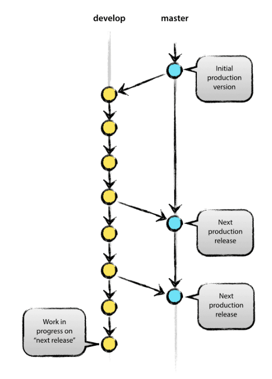
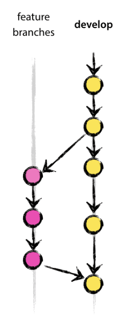

# 📝 Contributing Guidelines

---

## Table of Contents
- [Introduction](#introduction)
- [Commit Conventions](#commit-conventions)
    - [1. Basic Syntax](#1-basic-syntax)
    - [2. Commit Atomicity (Unit-of-Work)](#2-commit-atomicity-unit-of-work)
    - [3. Conventional Commit Format](#3-conventional-commit-format)
    - [4. Writing High-Quality Commit Messages](#4-writing-high-quality-commit-messages)
- [Branch Conventions](#branch-conventions)
    - [1. Summary](#1-summary)
    - [2. Naming Convention](#2-naming-convention)
    - [3. Main Branches](#3-main-branches)
    - [4. Supporting Branches](#4-supporting-branches)
        - [4.1 Feature Branches](#41-feature-branches)
        - [4.2 Issue Branches](#42-issue-branches)
        - [4.3 Hotfix Branches](#43-hotfix-branches)

---

## Introduction

- This guideline applies to **project collaborators only**.

- External contributions are not accepted at this time — please contact the repository owner if you wish to contribute in the future.

- Only the repository owner (admin) has direct **push** and **merge** access to the `develop` and `main` branches.  

- All other collaborators must work on feature branches and submit pull requests for review.

- These rules define the **standard workflow and conventions** to ensure code consistency, project stability, and effective collaboration.  

- Please review them carefully before committing, branching, or submitting a pull request.

## Commit Conventions

To keep a clean and consistent Git history, please follow these conventions when writing commit messages.

### 1. Basic Syntax

```
git commit -m "<type>: <short description>"
```

Each commit message should clearly explain what and why a change was made. Before committing, ask yourself:
- Why have I made these changes?
- What effect have my changes made?
- Why was the change needed?
- What are the changes in reference to?

### 2. Commit Atomicity (Unit of Work)

Each commit should represent a **single, complete, and independent unit of work** — this concept is called *atomicity*.  
An atomic commit ensures that:
- Every commit can be **reverted**, **reviewed**, or **cherry-picked** safely.
- The codebase remains **functional** at every point in the Git history.

In other words, **a commit should do one thing, and do it well**.

#### Best practices for atomic commits

- **One purpose per commit**
    - Example: Separate feature implementation, test addition, and formatting fixes into different commits.
    - Don’t mix unrelated changes such as feature + config + typo fixes.

- **Commit frequently, but meaningfully**
    - Small, logical commits are easier to review and track than large, mixed ones.

- **Ensure build/test passes at each commit**
    - Each commit should leave the project in a working state.


### 3. Conventional Commit Format
Follow the [Conventional Commits](https://www.conventionalcommits.org/en/v1.0.0/)
standard:
```
<type>: <description>
```

#### The commit type can include the following:

| Type       | Meaning                                                 |
| ---------- | ------------------------------------------------------- |
| `feat`     | Introduces a new feature                                |
| `fix`      | Fixes a bug                                             |
| `docs`     | Documentation updates (e.g. README, CONTRIBUTING)       |
| `style`    | Code style or formatting changes (no code logic impact) |
| `refactor` | Code restructuring that doesn’t change functionality    |
| `test`     | Adds or updates tests                                   |
| `chore`    | Routine tasks, maintenance, or dependency updates       |
| `perf`     | Performance improvements                                |
| `ci`       | Continuous integration or build pipeline changes        |
| `build`    | Changes to the build system or external dependencies    |
| `revert`   | Reverts a previous commit                               |

#### Example: 
- ``feat``: add user authentication module
- ``fix``: resolve race condition in Kafka consumer
- ``docs``: update contributing guide with commit rules

### 4. Writing High-Quality Commit Messages

Follow these best practices:

- Use the imperative mood
  - ✅ "add dark mode toggle"
  - ❌ "added dark mode toggle” or “adds dark mode toggle"

- Capitalize the first word of type and description, but do not end with punctuation
  - ✅ "fix: resolve UI glitch on mobile"
  - ❌ "Fix: Resolve UI glitch on mobile."

- Template for commit message:
  - Keep it concise:
    - Subject line ≤ 50 characters
    - Body lines ≤ 72 characters 
  - Explain the context (if needed)
  - **Avoid filler words:**
    - Be direct, skip words like "maybe", "I think", or "kind of".
  - Add a body (detail description) when the commit isn’t self-explanatory:
  - Template example:
    ```
    <short description>
    feat: add caching layer for user data
    <detail description>
    - The new caching system reduces database load by ~30%.
    - It uses Redis for fast in-memory lookups.
    ```

---

## Branch Conventions

This project follows the [**Git Flow branching model**](https://nvie.com/posts/a-successful-git-branching-model/#hotfix-branches) to maintain stability and streamline collaboration.



---

### 1. Summary

<table>
  <thead>
    <tr>
      <th>Environment</th>
      <th>Branch</th>
      <th>Description</th>
    </tr>
  </thead>
  <tbody>
    <tr>
      <td>Stable</td>
      <td><code>main</code></td>
      <td>Accepts merges from <code>develop</code> and <code>hotfix/*</code></td>
    </tr>
    <tr>
      <td>Working</td>
      <td><code>develop</code></td>
      <td>Accepts merges from <code>feature/*</code>, <code>issue/*</code>, and <code>hotfix/*</code></td>
    </tr>
    <tr>
      <td>Feature / Issue</td>
      <td><code>feature/*</code>, <code>issue/*</code></td>
      <td>Always branch from the latest <code>develop</code></td>
    </tr>
    <tr>
      <td>Hotfix</td>
      <td><code>hotfix/*</code></td>
      <td>Always branch from <code>main</code></td>
    </tr>
  </tbody>
</table>

---

### 2. Naming Convention
```
<type>/<short-description>
```

#### Common branch types
- `feature/` → for developing new features
- `bugfix/` → for fixing non-critical bugs
- `hotfix/` → for urgent fixes in production
- `release/` → for preparing a release version
- `chore/` → for maintenance tasks (CI/CD, configs, etc.)

#### Examples

```
feature/login-google
bugfix/cart-empty-error
hotfix/payment-crash
release/v1.2.0
chore/update-dependencies
feature/user-profile-management
bugfix/responsive-layout-mobile
```

---

## 3. Main Branches

A repository must always include the following permanent branches:

- **`main`** — represents the production-ready code.
- **`develop`** — represents the latest development changes for the upcoming release.



### Description

- `develop` (or `origin/develop`) always contains the most recent development updates for the next release.  
  It is branched from `main` and periodically merged back when stable.

- `main` (or `origin/main`) contains the production-ready code currently deployed.

When the `develop` branch reaches a stable state and passes testing, it is merged back into `main`, followed by tagging a new release version.

---

## 4. Supporting Branches

Supporting branches enable parallel development among team members.  
Unlike the main branches, these are **temporary** and should be deleted once their purpose is fulfilled.

The following types are commonly used:
- `feature` branches
- `issue` branches
- `hotfix` branches

Each type serves a specific purpose and follows strict branching and merging rules.

---

### 4.1. Feature Branches

Feature branches are used to develop new features or major enhancements that may span multiple release cycles.  
Regardless of their lifecycle, **feature branches must always merge back into `develop`.**



#### Rules:
- Must branch from: `develop`
- Must merge back into: `develop`
- Naming convention: `feature/<id>`

#### Workflow:
- If the branch does not exist yet:
    ```
    git checkout -b feature/<id> develop
    git push origin feature/<id>
    ```
  
- Regularly sync updates from ``develop`` to keep it up to date:
    ```
    git merge develop
    ```
- When the feature is complete:
    ```
    git checkout develop
    git merge --no-ff feature/<id>
    git push origin develop
    git push origin :feature/<id>     # deletes the remote branch
    ```
If you don’t have write access to develop, push your branch to GitHub and open a pull request.

---

### 4.2. Issue Branches

Issue branches are used to fix bugs or issues scheduled for the next release.
They are semantically different from feature branches but follow the same workflow.
Like features, they must always merge back into develop.

#### Rules:
- Must branch from: develop
- Must merge back into: develop
- Naming convention: issue/<id>

#### Workflow:
```
git checkout -b issue/<id> develop
git push origin issue/<id>
```

- Sync updates from develop regularly:
    ```
    git merge develop
    ```

- When the fix is ready:
    ```
    git checkout develop
    git merge --no-ff issue/<id>
    git push origin develop
    git push origin :issue/<id>       # deletes the remote branch
    ```

For contributors without write access, submit your changes through a pull request.

---

### 4.3. Hotfix Branches

Hotfix branches are used for urgent fixes on production when something critical fails.
They always branch from main and must be merged into both main and develop after completion.


#### Rules:
- Must branch from: main
- Must merge back into: main and develop
- Naming convention: hotfix/<id>

#### Workflow:
- Create the branch:
    ```
    git checkout -b hotfix/<id> main
    git push origin hotfix/<id>
    ```
- After the fix is complete:
    ```
    git checkout main
    git merge --no-ff hotfix/<id>
    git tag -a <tag>                   # tag the fix
    git push origin main --tags
    ```
- Merge the fix into develop to keep branches synchronized:
    ```
    git checkout develop
    git merge --no-ff hotfix/<id>
    git push origin develop
    git push origin :hotfix/<id>       # deletes the remote branch
    ```
